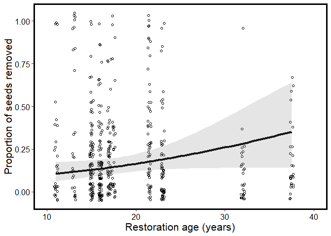
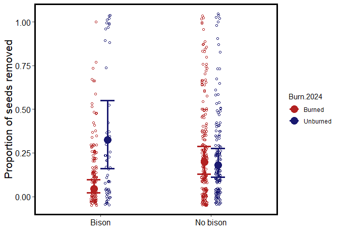
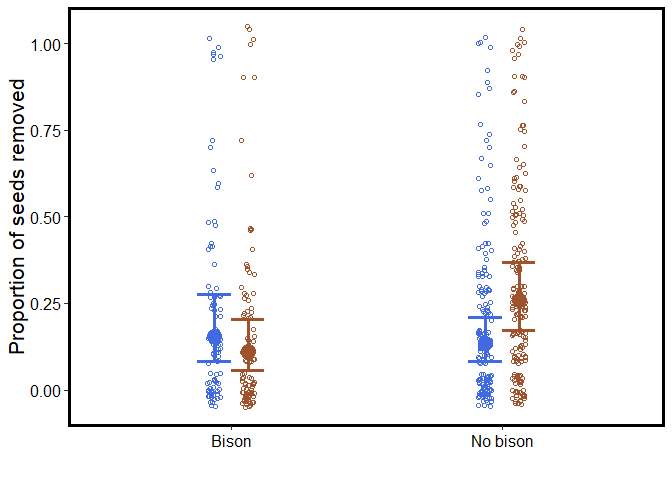
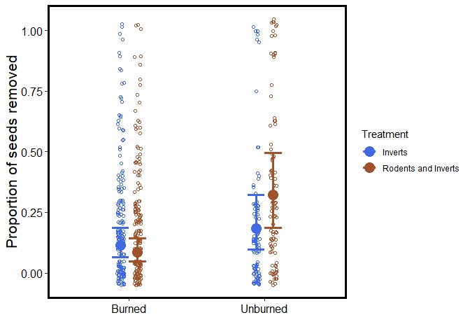
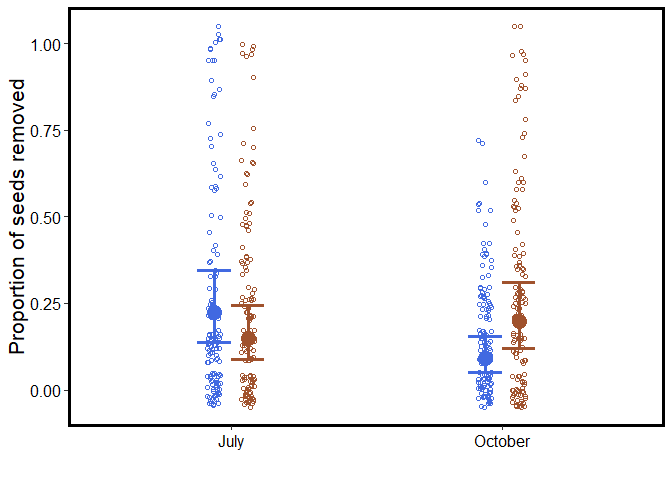
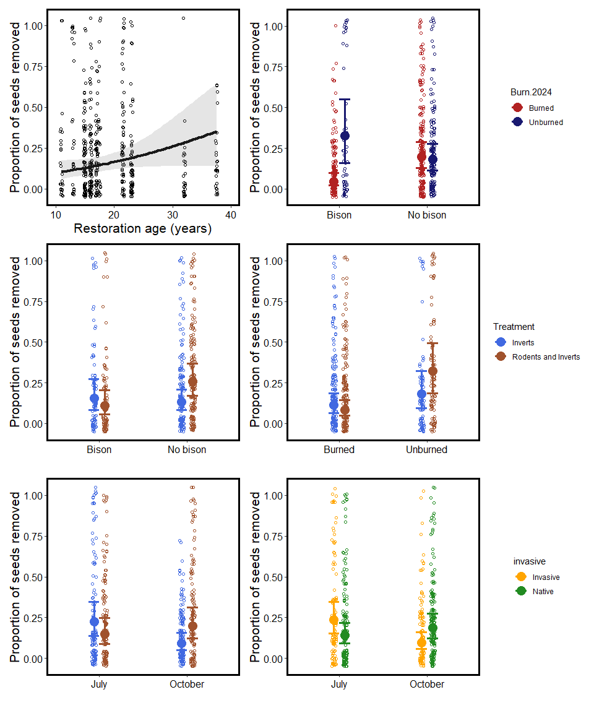

Part 1: Seed removal responses to management
================
Pete Guiden
2024-12-05

- [Inspecting the data](#inspecting-the-data)
- [Model construction](#model-construction)
- [Model output](#model-output)
  - [1) Restoration age](#1-restoration-age)
  - [2) Bison x Fire](#2-bison-x-fire)
  - [3) Bison x Guild](#3-bison-x-guild)
  - [4) Fire x Guild](#4-fire-x-guild)
  - [5) Month x Guild](#5-month-x-guild)
  - [6) Month x Provenance](#6-month-x-provenance)

This code provides a preliminary inspection of seed removal data
collected at 19 ReFUGE plots at Nachusa Grasslands in July and October
2024. 8 seeds of 7 species (list here) were placed cafeteria-style in
buckets that allowed access to either invertebrates alone, or
invertebrates and rodents. Plots vary in their management history
(restoration age, bison presence, burn status for 2024).

Expect this code to be the main data presented in a manuscript examining
how management influences seed removal of native versus invasive plant
species.

## Inspecting the data

First step is to inspect the data before running any analyses.

There is one tricky things about the data that should be mentioned:
while we only put 8 seeds per species in each bucket, some buckets had
\>8 seeds of a species found. This is a low proportion (n = 14 cases out
of 531 species-bucket combinations, or 2.6%). My current resolution for
this was to assume that these cases had no seed removal of that species,
and to recalculate the total number of starting seeds to be whatever the
number of intact seeds recovered was. Should be a conservative way to
estimate seed removal without losing data, although I suspect running
models with and without these species/bucket combos will yield very
similar outcomes.

We can also check out some quick and dirty figures summarizing the data.
Looks like no issues with zero-inflation, etc., so a binomial glmer()
should work ok.

``` r
summary(seed.data)
```

    ##        ID          Planting            Month            Treatment        
    ##  Min.   :  1.0   Length:531         Length:531         Length:531        
    ##  1st Qu.:133.5   Class :character   Class :character   Class :character  
    ##  Median :266.0   Mode  :character   Mode  :character   Mode  :character  
    ##  Mean   :266.0                                                           
    ##  3rd Qu.:398.5                                                           
    ##  Max.   :531.0                                                           
    ##                                                                          
    ##    Species          Number.of.seeds.intact Number.of.damaged.seeds
    ##  Length:531         Min.   : 0.0           Min.   :1.00           
    ##  Class :character   1st Qu.: 5.0           1st Qu.:1.00           
    ##  Mode  :character   Median : 7.0           Median :1.00           
    ##                     Mean   : 6.2           Mean   :1.86           
    ##                     3rd Qu.: 8.0           3rd Qu.:2.00           
    ##                     Max.   :14.0           Max.   :8.00           
    ##                                            NA's   :424            
    ##  Evidence.of.damaged.seeds.    Notes            total.seeds     intact.seeds 
    ##  Length:531                 Length:531         Min.   : 8.00   Min.   : 0.0  
    ##  Class :character           Class :character   1st Qu.: 8.00   1st Qu.: 5.0  
    ##  Mode  :character           Mode  :character   Median : 8.00   Median : 7.0  
    ##                                                Mean   : 8.04   Mean   : 6.2  
    ##                                                3rd Qu.: 8.00   3rd Qu.: 8.0  
    ##                                                Max.   :14.00   Max.   :14.0  
    ##                                                                              
    ##  removed.seeds  prop.intact.seeds   invasive            Bison          
    ##  Min.   :0.00   Min.   :0.000     Length:531         Length:531        
    ##  1st Qu.:0.00   1st Qu.:0.625     Class :character   Class :character  
    ##  Median :1.00   Median :0.875     Mode  :character   Mode  :character  
    ##  Mean   :1.84   Mean   :0.770                                          
    ##  3rd Qu.:3.00   3rd Qu.:1.000                                          
    ##  Max.   :8.00   Max.   :1.000                                          
    ##                                                                        
    ##   Burn.2024         Year.restored       lat             lon        
    ##  Length:531         Min.   :1986   Min.   :41.87   Min.   :-89.37  
    ##  Class :character   1st Qu.:2002   1st Qu.:41.88   1st Qu.:-89.36  
    ##  Mode  :character   Median :2007   Median :41.89   Median :-89.33  
    ##                     Mean   :2005   Mean   :41.89   Mean   :-89.34  
    ##                     3rd Qu.:2009   3rd Qu.:41.90   3rd Qu.:-89.33  
    ##                     Max.   :2013   Max.   :41.90   Max.   :-89.31  
    ##                     NA's   :56                                     
    ##     rest.age    
    ##  Min.   :11.00  
    ##  1st Qu.:15.00  
    ##  Median :17.00  
    ##  Mean   :19.25  
    ##  3rd Qu.:21.50  
    ##  Max.   :37.50  
    ##  NA's   :56

``` r
# How many buckets had more than 8 seeds recovered per species?
length(filter(seed.data, intact.seeds > 8)$ID)
```

    ## [1] 14

``` r
length(filter(seed.data, intact.seeds > 8)$ID)/length(seed.data$ID)
```

    ## [1] 0.02636535

``` r
ggplot(seed.data, aes(x = Species, fill = Treatment, y = prop.intact.seeds))+
  facet_wrap(~Month)+
  geom_boxplot()
```

<!-- -->

``` r
ggplot(seed.data, aes(x = prop.intact.seeds, fill = Treatment))+
  facet_wrap(Month~Species)+
  geom_histogram()
```

    ## `stat_bin()` using `bins = 30`. Pick better value with `binwidth`.

<!-- -->

## Model construction

After inspecting the data, we can run some models.

Before modeling for real, I like to run an lmer() strictly to check the
denominator DF’s to make sure the model is accurately interpreting our
experimental design (following the advice of Arnqvist 2020 TREE). For
example, any management action should be replicated at the planting
level, not the bucket level (so it should have ~18 DDFs instead of ~500
DDFs). After some tinkering, I ended up with a random intercept term
nesting Bucket (new variable combining planting/month/treatment) inside
Planting (i.e., (1\|Planting/Treatment)), which makes sense. I also add
a random intercept for the unit of replication (i.e.,
species-planting-month-treatment) combination, which matches the ID
column; (1\|ID)), which helps account for overdispersion in
binomial/Poisson models.

It bears repeating but *we don’t care about the coefficients or P-values
here*; this exercise is simply done to eyeball the denominator degrees
of freedom to increase our confidence about random effects structures.

``` r
# Check with regular lmer: Bucket is nested within Planting!

# Create a new variable for bucket
seed.data$bucket <- paste(seed.data$Planting, ' ',  seed.data$Treatment, ' ', seed.data$Month)

seed.model.check = lmer(data = seed.data,
                   prop.intact.seeds~Treatment*invasive+invasive*Month+Bison*Burn.2024+
                     (1|Planting/bucket)+
                     (1|Species))
```

    ## boundary (singular) fit: see help('isSingular')

``` r
Anova(seed.model.check, test = 'F')
```

    ## Analysis of Deviance Table (Type II Wald F tests with Kenward-Roger df)
    ## 
    ## Response: prop.intact.seeds
    ##                          F Df Df.res   Pr(>F)    
    ## Treatment           1.2797  1  55.00  0.26287    
    ## invasive            0.0002  1   5.00  0.98969    
    ## Month               0.4312  1  55.00  0.51415    
    ## Bison               1.5456  1  15.01  0.23286    
    ## Burn.2024           0.6183  1  15.01  0.44390    
    ## Treatment:invasive  0.2389  1 447.06  0.62521    
    ## invasive:Month     18.2157  1 447.06 2.41e-05 ***
    ## Bison:Burn.2024     4.2591  1  15.04  0.05675 .  
    ## ---
    ## Signif. codes:  0 '***' 0.001 '**' 0.01 '*' 0.05 '.' 0.1 ' ' 1

After the random effects are structure properly, we can get into the
real modeling. Since we’re interested in knowing the proportion of seeds
removed, we’ll use a binomial GLMM withn the cbind() function. Note that
the order of terms in cbind() matters; here we’ll go cbind(removed,
intact) to express results as the **proportion of seeds removed**. We’ll
use this convention throughout.

As far as structuring the model, we have some decisions to make. We have
six key variables we are hypothesizing to be important: age (continuous,
no remnants), bison (present/absent), fire (burned/unburned), treatment
(inverts, rodents+inverts), month (Jul, Oct), and species (7 levels).
**We will keep all of these main effects in the model**. However, we
also have reason to think that interactions might be important (e.g.,
bison might affect rodents and inverts differently). We’ll use model
selection (MuMIn package) to tell us which interactions are the most
important, starting with a global model with….6 main effects and 15(!!!)
interactive effects. Unsurprisingly, the global model has two key
weaknesses: 1) model diagnostics suggest problems (huge VIF, etc.) and
2) model convergence requires a lot of computer power (~90 minutes on my
machine). Code for this model selection process is hidden in a code
chunk below, but is commented out because it takes \>3 hours to perform.
We decided *a priori* in a Dec 5 meeting to retain the simplest top
model. R returned 4 models with \<2 AICc, and no clear winner.
Therefore, we’ll keep the simplest of the “best” 4 models; it has the
added bonus of slightly nicer model diagnostics, too.

    ## boundary (singular) fit: see help('isSingular')

<!-- -->

    ## Generalized linear mixed model fit by maximum likelihood (Laplace
    ##   Approximation) [glmerMod]
    ##  Family: binomial  ( logit )
    ## Formula: cbind(removed.seeds, intact.seeds) ~ Bison + Burn.2024 + Month +  
    ##     invasive + Treatment + scale(rest.age) + Bison * Burn.2024 +  
    ##     Bison * Treatment + Burn.2024 * Treatment + invasive * Month +  
    ##     Month * Treatment + (1 | Planting/bucket) + (1 | Species) +      (1 | ID)
    ##    Data: seed.data
    ## Control: glmerControl(optimizer = "bobyqa", optCtrl = list(maxfun = 2e+05))
    ## 
    ##      AIC      BIC   logLik deviance df.resid 
    ##   1596.2   1662.8   -782.1   1564.2      459 
    ## 
    ## Scaled residuals: 
    ##      Min       1Q   Median       3Q      Max 
    ## -1.35393 -0.63400 -0.07904  0.38440  1.77656 
    ## 
    ## Random effects:
    ##  Groups          Name        Variance Std.Dev.
    ##  ID              (Intercept) 1.01123  1.0056  
    ##  bucket:Planting (Intercept) 0.97124  0.9855  
    ##  Planting        (Intercept) 0.00000  0.0000  
    ##  Species         (Intercept) 0.06626  0.2574  
    ## Number of obs: 475, groups:  
    ## ID, 475; bucket:Planting, 68; Planting, 17; Species, 7
    ## 
    ## Fixed effects:
    ##                                                Estimate Std. Error z value
    ## (Intercept)                                     -1.7310     0.5343  -3.240
    ## BisonNo bison                                    1.0319     0.5538   1.864
    ## Burn.2024Unburned                                1.7682     0.7531   2.348
    ## MonthOctober                                    -1.7582     0.4316  -4.074
    ## invasiveNative                                  -0.6162     0.2792  -2.207
    ## TreatmentRodents and Inverts                    -1.6328     0.5975  -2.733
    ## scale(rest.age)                                  0.3823     0.2046   1.868
    ## BisonNo bison:Burn.2024Unburned                 -2.4128     0.7567  -3.189
    ## BisonNo bison:TreatmentRodents and Inverts       1.1955     0.5938   2.013
    ## Burn.2024Unburned:TreatmentRodents and Inverts   1.0819     0.5688   1.902
    ## MonthOctober:invasiveNative                      1.3802     0.2844   4.853
    ## MonthOctober:TreatmentRodents and Inverts        1.4104     0.5583   2.526
    ##                                                Pr(>|z|)    
    ## (Intercept)                                     0.00120 ** 
    ## BisonNo bison                                   0.06239 .  
    ## Burn.2024Unburned                               0.01889 *  
    ## MonthOctober                                   4.62e-05 ***
    ## invasiveNative                                  0.02733 *  
    ## TreatmentRodents and Inverts                    0.00628 ** 
    ## scale(rest.age)                                 0.06173 .  
    ## BisonNo bison:Burn.2024Unburned                 0.00143 ** 
    ## BisonNo bison:TreatmentRodents and Inverts      0.04408 *  
    ## Burn.2024Unburned:TreatmentRodents and Inverts  0.05718 .  
    ## MonthOctober:invasiveNative                    1.22e-06 ***
    ## MonthOctober:TreatmentRodents and Inverts       0.01153 *  
    ## ---
    ## Signif. codes:  0 '***' 0.001 '**' 0.01 '*' 0.05 '.' 0.1 ' ' 1
    ## 
    ## Correlation of Fixed Effects:
    ##             (Intr) BsnNbs B.2024 MnthOc invsvN TrtRaI scl(.) BNb:B. BNb:aI
    ## BisonNbison -0.710                                                        
    ## Brn.2024Unb -0.572  0.502                                                 
    ## MonthOctobr -0.389  0.012 -0.003                                          
    ## invasiveNtv -0.281 -0.007 -0.012  0.179                                   
    ## TrtmntRdnaI -0.519  0.309  0.094  0.310  0.008                            
    ## scal(rst.g) -0.476  0.518  0.636  0.003 -0.012 -0.001                     
    ## BNb:B.2024U  0.484 -0.629 -0.821 -0.001  0.013  0.032 -0.590              
    ## BsnNbs:TRaI  0.330 -0.519  0.066 -0.015 -0.009 -0.633  0.000 -0.029       
    ## B.2024U:TaI  0.168  0.069 -0.379  0.003 -0.002 -0.334  0.003 -0.008 -0.100
    ## MnthOctbr:N  0.131  0.007  0.009 -0.396 -0.497 -0.011  0.014 -0.012  0.010
    ## MnthOc:TRaI  0.261 -0.007  0.006 -0.659 -0.003 -0.493 -0.003 -0.004  0.028
    ##             B.20aI MntO:N
    ## BisonNbison              
    ## Brn.2024Unb              
    ## MonthOctobr              
    ## invasiveNtv              
    ## TrtmntRdnaI              
    ## scal(rst.g)              
    ## BNb:B.2024U              
    ## BsnNbs:TRaI              
    ## B.2024U:TaI              
    ## MnthOctbr:N  0.006       
    ## MnthOc:TRaI  0.009  0.019
    ## optimizer (bobyqa) convergence code: 0 (OK)
    ## boundary (singular) fit: see help('isSingular')

    ## Analysis of Deviance Table (Type II Wald chisquare tests)
    ## 
    ## Response: cbind(removed.seeds, intact.seeds)
    ##                       Chisq Df Pr(>Chisq)    
    ## Bison                2.5059  1   0.113423    
    ## Burn.2024            1.1589  1   0.281701    
    ## Month                0.7575  1   0.384127    
    ## invasive             0.0569  1   0.811429    
    ## Treatment            1.3260  1   0.249518    
    ## scale(rest.age)      3.4903  1   0.061730 .  
    ## Bison:Burn.2024     10.1674  1   0.001429 ** 
    ## Bison:Treatment      4.0536  1   0.044077 *  
    ## Burn.2024:Treatment  3.6174  1   0.057179 .  
    ## Month:invasive      23.5495  1  1.217e-06 ***
    ## Month:Treatment      6.3817  1   0.011530 *  
    ## ---
    ## Signif. codes:  0 '***' 0.001 '**' 0.01 '*' 0.05 '.' 0.1 ' ' 1

## Model output

Ok, lots to unpack here! We’ll use the emmeans package to visualize key
interactive effects, including post-hoc tests to determine significance
between categorical groups. There is one significant main effect and
five significant interactions to examine:

### 1) Restoration age

A simple linear increase here–older plantings experienced more seed
removal than younger ones. The oldest of our plantings(37 years)
experienced 3.5x more seed removal than the youngest plantings (11
years). Not that this figure does not include remnants.

``` r
age.emm <- summary(emmeans(small.model, ~rest.age, type = 'response',
                           at = list(rest.age = seq(11, 37.50, 0.50))))

fig.1a<- ggplot(age.emm, aes(x = rest.age, y = prob))+
  geom_line(size = 1.5)+
  geom_jitter(data = seed.data, aes(y = 1-prop.intact.seeds), shape = 1)+
  geom_ribbon(aes(ymin = asymp.LCL, ymax = asymp.UCL),
                size = 1.25, width = 0.25, fill = 'grey50', alpha = 0.2, color = NA)+
  labs(x = 'Restoration age (years)', y = 'Proportion of seeds removed')+
  scale_x_continuous(limits = c(10, 40))+
  #scale_color_manual(values = c('forestgreen', 'sienna'))+
  pal.theme
```

    ## Warning: Using `size` aesthetic for lines was deprecated in ggplot2 3.4.0.
    ## ℹ Please use `linewidth` instead.
    ## This warning is displayed once every 8 hours.
    ## Call `lifecycle::last_lifecycle_warnings()` to see where this warning was
    ## generated.

    ## Warning in geom_ribbon(aes(ymin = asymp.LCL, ymax = asymp.UCL), size = 1.25, :
    ## Ignoring unknown parameters: `width`

``` r
fig.1a
```

    ## Warning: Removed 56 rows containing missing values or values outside the scale range
    ## (`geom_point()`).

<!-- -->

### 2) Bison x Fire

Averaged across all treatments, plantings that both were burned and
allowed bison access had the lowest amount of seed removal. Some
interesting tidbits: -Looking only at plots with bison access, seed
removal was **7 times lower** in burned vs unburned plots -Looking only
at unburned plots, there’s no difference in seed removal between bison
absent and bison present plots. This suggests that you really might want
both management practices if minimizing seed removal is important.

    ## $emmeans
    ##  Bison    Burn.2024   prob     SE  df asymp.LCL asymp.UCL
    ##  Bison    Burned    0.0458 0.0178 Inf    0.0212    0.0962
    ##  No bison Burned    0.1967 0.0403 Inf    0.1293    0.2875
    ##  Bison    Unburned  0.3257 0.1048 Inf    0.1594    0.5516
    ##  No bison Unburned  0.1808 0.0418 Inf    0.1127    0.2773
    ## 
    ## Results are averaged over the levels of: Month, invasive, Treatment 
    ## Confidence level used: 0.95 
    ## Intervals are back-transformed from the logit scale 
    ## 
    ## $contrasts
    ##  contrast                            odds.ratio     SE  df null z.ratio p.value
    ##  Bison Burned / No bison Burned          0.1960 0.0928 Inf    1  -3.441  0.0032
    ##  Bison Burned / Bison Unburned           0.0993 0.0692 Inf    1  -3.313  0.0051
    ##  Bison Burned / No bison Unburned        0.2174 0.1100 Inf    1  -3.016  0.0137
    ##  No bison Burned / Bison Unburned        0.5069 0.2571 Inf    1  -1.339  0.5377
    ##  No bison Burned / No bison Unburned     1.1092 0.3831 Inf    1   0.300  0.9906
    ##  Bison Unburned / No bison Unburned      2.1883 1.1085 Inf    1   1.546  0.4099
    ## 
    ## Results are averaged over the levels of: Month, invasive, Treatment 
    ## P value adjustment: tukey method for comparing a family of 4 estimates 
    ## Tests are performed on the log odds ratio scale

<!-- -->

### 3) Bison x Guild

Now we can start looking at how management affects different granivore
guilds. First up, a significant bison x guild interaction. Key take-home
here is that in the Inverts only depots, there is no difference in seed
removal between plots with and without bison. However, where rodents and
inverts both are able to access seeds, we see 2.5 times more seed
removal in plots without bison compared to plots with bison. I interpret
this as perhaps evidence that there is a behavioral change in rodents
where bison are present (Guiden et al. 2022 Ecology).

``` r
emmeans(small.model, pairwise~Bison*Treatment, type = 'response', adjust = 'Tukey')
```

    ## $emmeans
    ##  Bison    Treatment            prob     SE  df asymp.LCL asymp.UCL
    ##  Bison    Inverts             0.156 0.0482 Inf    0.0827     0.275
    ##  No bison Inverts             0.134 0.0316 Inf    0.0834     0.209
    ##  Bison    Rodents and Inverts 0.111 0.0364 Inf    0.0575     0.205
    ##  No bison Rodents and Inverts 0.258 0.0507 Inf    0.1718     0.369
    ## 
    ## Results are averaged over the levels of: Burn.2024, Month, invasive 
    ## Confidence level used: 0.95 
    ## Intervals are back-transformed from the logit scale 
    ## 
    ## $contrasts
    ##  contrast                                                 odds.ratio    SE  df
    ##  Bison Inverts / No bison Inverts                              1.191 0.514 Inf
    ##  Bison Inverts / Bison Rodents and Inverts                     1.472 0.720 Inf
    ##  Bison Inverts / No bison Rodents and Inverts                  0.530 0.229 Inf
    ##  No bison Inverts / Bison Rodents and Inverts                  1.236 0.538 Inf
    ##  No bison Inverts / No bison Rodents and Inverts               0.445 0.153 Inf
    ##  Bison Rodents and Inverts / No bison Rodents and Inverts      0.360 0.155 Inf
    ##  null z.ratio p.value
    ##     1   0.404  0.9777
    ##     1   0.791  0.8586
    ##     1  -1.470  0.4556
    ##     1   0.488  0.9619
    ##     1  -2.353  0.0864
    ##     1  -2.376  0.0817
    ## 
    ## Results are averaged over the levels of: Burn.2024, Month, invasive 
    ## P value adjustment: tukey method for comparing a family of 4 estimates 
    ## Tests are performed on the log odds ratio scale

``` r
bison.treat.emm <- summary(emmeans(small.model, ~Bison*Treatment, type = 'response'))

fig.1c <- ggplot(bison.treat.emm, aes(x = Bison, y = prob, color = Treatment))+
  geom_point(position = position_dodge(width = 0.25), size = 5)+
  geom_point(data = seed.data, aes(y = 1-prop.intact.seeds), shape = 1,
             position = position_jitterdodge(dodge.width = 0.25,
                                             jitter.height = 0.05,
                                             jitter.width = 0.05))+
  geom_errorbar(aes(ymin = asymp.LCL, ymax = asymp.UCL),
                size = 1.25, width = 0.25,
                position = position_dodge(width = 0.25))+
  labs(x = '', y = 'Proportion of seeds removed')+
  scale_y_continuous(limits = c(-0.05, 1.05))+
  scale_color_manual(values = c('royalblue', 'goldenrod1'))+
  pal.theme+guides(color = 'none')
fig.1c
```

<!-- -->

### 4) Fire x Guild

Burning seems to increase seed removal, but only by rodents. There is no
difference between Invert-only depots in burned versus unburned
plantings. On the other hand, depots allowing inverts and rodents
experienced 4x greater seed removal in unburned areas vs burned areas
(thatch = vole city?). There’s also a compelling increase in seed
removal between unburned plantings allowing rodents compared to unburned
plantings with only inverts.

``` r
emmeans(small.model, pairwise~Burn.2024*Treatment, type = 'response', adjust = 'Tukey')
```

    ## $emmeans
    ##  Burn.2024 Treatment             prob     SE  df asymp.LCL asymp.UCL
    ##  Burned    Inverts             0.1133 0.0304 Inf    0.0660     0.188
    ##  Unburned  Inverts             0.1831 0.0570 Inf    0.0961     0.321
    ##  Burned    Rodents and Inverts 0.0842 0.0239 Inf    0.0477     0.144
    ##  Unburned  Rodents and Inverts 0.3223 0.0805 Inf    0.1876     0.495
    ## 
    ## Results are averaged over the levels of: Bison, Month, invasive 
    ## Confidence level used: 0.95 
    ## Intervals are back-transformed from the logit scale 
    ## 
    ## $contrasts
    ##  contrast                                                  odds.ratio     SE
    ##  Burned Inverts / Unburned Inverts                              0.570 0.2808
    ##  Burned Inverts / Burned Rodents and Inverts                    1.391 0.5177
    ##  Burned Inverts / Unburned Rodents and Inverts                  0.269 0.1323
    ##  Unburned Inverts / Burned Rodents and Inverts                  2.439 1.2372
    ##  Unburned Inverts / Unburned Rodents and Inverts                0.471 0.2130
    ##  Burned Rodents and Inverts / Unburned Rodents and Inverts      0.193 0.0943
    ##   df null z.ratio p.value
    ##  Inf    1  -1.141  0.6643
    ##  Inf    1   0.886  0.8120
    ##  Inf    1  -2.668  0.0382
    ##  Inf    1   1.758  0.2939
    ##  Inf    1  -1.664  0.3426
    ##  Inf    1  -3.369  0.0042
    ## 
    ## Results are averaged over the levels of: Bison, Month, invasive 
    ## P value adjustment: tukey method for comparing a family of 4 estimates 
    ## Tests are performed on the log odds ratio scale

``` r
fire.treat.emm <- summary(emmeans(small.model, ~Burn.2024*Treatment, type = 'response'))

fig.1d <- ggplot(fire.treat.emm, aes(x = Burn.2024, y = prob, color = Treatment))+
  geom_point(position = position_dodge(width = 0.25), size = 5)+
  geom_point(data = seed.data, aes(y = 1-prop.intact.seeds), shape = 1,
             position = position_jitterdodge(dodge.width = 0.25,
                                             jitter.height = 0.05,
                                             jitter.width = 0.05))+
  geom_errorbar(aes(ymin = asymp.LCL, ymax = asymp.UCL),
                size = 1.25, width = 0.25,
                position = position_dodge(width = 0.25))+
  labs(x = '', y = 'Proportion of seeds removed')+
  scale_y_continuous(limits = c(-0.05, 1.05))+
  scale_color_manual(values = c('royalblue', 'goldenrod1'))+
  pal.theme
fig.1d
```

<!-- -->

### 5) Month x Guild

And finally, we see some evidence that the magnitude of seed removal by
the two consumer guilds changed over time, but in different directions.
In July, seed removal by invertebrates was more than twice as strong
compared to October. There was no significant change in rodent seed
removal between the two months. This makes complete sense given the
rather cold weather we experienced in mid-October. This also supports
the previous point about native vs. non-native species.

``` r
emmeans(small.model, pairwise~Month*Treatment, type = 'response', adjust = 'Tukey')
```

    ## $emmeans
    ##  Month   Treatment             prob     SE  df asymp.LCL asymp.UCL
    ##  July    Inverts             0.2241 0.0537 Inf    0.1361     0.346
    ##  October Inverts             0.0903 0.0258 Inf    0.0509     0.155
    ##  July    Rodents and Inverts 0.1498 0.0399 Inf    0.0871     0.245
    ##  October Rodents and Inverts 0.1988 0.0484 Inf    0.1203     0.310
    ## 
    ## Results are averaged over the levels of: Bison, Burn.2024, invasive 
    ## Confidence level used: 0.95 
    ## Intervals are back-transformed from the logit scale 
    ## 
    ## $contrasts
    ##  contrast                                               odds.ratio    SE  df
    ##  July Inverts / October Inverts                              2.910 1.156 Inf
    ##  July Inverts / July Rodents and Inverts                     1.639 0.678 Inf
    ##  July Inverts / October Rodents and Inverts                  1.164 0.473 Inf
    ##  October Inverts / July Rodents and Inverts                  0.563 0.234 Inf
    ##  October Inverts / October Rodents and Inverts               0.400 0.163 Inf
    ##  July Rodents and Inverts / October Rodents and Inverts      0.710 0.280 Inf
    ##  null z.ratio p.value
    ##     1   2.689  0.0361
    ##     1   1.195  0.6302
    ##     1   0.373  0.9822
    ##     1  -1.381  0.5110
    ##     1  -2.251  0.1098
    ##     1  -0.869  0.8206
    ## 
    ## Results are averaged over the levels of: Bison, Burn.2024, invasive 
    ## P value adjustment: tukey method for comparing a family of 4 estimates 
    ## Tests are performed on the log odds ratio scale

``` r
month.treatment.emm <- summary(emmeans(small.model, ~Month*Treatment, type = 'response'))

fig.1e <- ggplot(month.treatment.emm, aes(x = Month, y = prob, color = Treatment))+
  geom_point(position = position_dodge(width = 0.25), size = 5)+
  geom_point(data = seed.data, aes(y = 1-prop.intact.seeds), shape = 1,
             position = position_jitterdodge(dodge.width = 0.25,
                                             jitter.height = 0.05,
                                             jitter.width = 0.05))+
  geom_errorbar(aes(ymin = asymp.LCL, ymax = asymp.UCL),
                size = 1.25, width = 0.25,
                position = position_dodge(width = 0.25))+
  labs(x = '', y = 'Proportion of seeds removed')+
  scale_y_continuous(limits = c(-0.05, 1.05))+
  scale_color_manual(values = c('royalblue', 'goldenrod1'))+
  pal.theme+guides(color = 'none')
fig.1e
```

<!-- -->

### 6) Month x Provenance

Grouping species together as native vs non-native, we see that the
problematic non-native species are almost 2.5x more likely to be removed
in summer than fall. There is no difference in seed removal between
native species in summer and fall. This could suggest that seed removal
by inverts is key for non-native species as a whole.

Probably want to keep the old species-by-species figure as a supplement
to unpack these patterns.

``` r
emmeans(small.model, pairwise~Month*invasive, type = 'response', adjust = 'Tukey')
```

    ## $emmeans
    ##  Month   invasive   prob     SE  df asymp.LCL asymp.UCL
    ##  July    Invasive 0.2348 0.0500 Inf    0.1511     0.346
    ##  October Invasive 0.0967 0.0251 Inf    0.0575     0.158
    ##  July    Native   0.1422 0.0322 Inf    0.0900     0.217
    ##  October Native   0.1869 0.0389 Inf    0.1222     0.275
    ## 
    ## Results are averaged over the levels of: Bison, Burn.2024, Treatment 
    ## Confidence level used: 0.95 
    ## Intervals are back-transformed from the logit scale 
    ## 
    ## $contrasts
    ##  contrast                          odds.ratio    SE  df null z.ratio p.value
    ##  July Invasive / October Invasive       2.866 0.931 Inf    1   3.243  0.0065
    ##  July Invasive / July Native            1.852 0.517 Inf    1   2.207  0.1213
    ##  July Invasive / October Native         1.335 0.488 Inf    1   0.791  0.8587
    ##  October Invasive / July Native         0.646 0.242 Inf    1  -1.164  0.6496
    ##  October Invasive / October Native      0.466 0.132 Inf    1  -2.704  0.0346
    ##  July Native / October Native           0.721 0.219 Inf    1  -1.079  0.7024
    ## 
    ## Results are averaged over the levels of: Bison, Burn.2024, Treatment 
    ## P value adjustment: tukey method for comparing a family of 4 estimates 
    ## Tests are performed on the log odds ratio scale

``` r
month.invasive.emm <- summary(emmeans(small.model, ~Month*invasive, type = 'response'))

fig.1f <- ggplot(month.invasive.emm, aes(x = Month, y = prob, color = invasive))+
  geom_point(position = position_dodge(width = 0.25), size = 5)+
  geom_point(data = seed.data, aes(y = 1-prop.intact.seeds), shape = 1,
             position = position_jitterdodge(dodge.width = 0.25,
                                             jitter.height = 0.05,
                                             jitter.width = 0.05))+
  geom_errorbar(aes(ymin = asymp.LCL, ymax = asymp.UCL),
                size = 1.25, width = 0.25,
                position = position_dodge(width = 0.25))+
  labs(x = '', y = 'Proportion of seeds removed')+
  scale_y_continuous(limits = c(-0.05, 1.05))+
  scale_color_manual(values = c('forestgreen', 'sienna'))+
  pal.theme
fig.1f
```

<!-- --> \##
Final figure output

Ok, now to glue these key findings into a single 6-panel figure using
the “patchwork” package. Outputting this in a nice large dimension,
although I will touch up with powerpoint/illustrator to add letters,
extra space between the columns, and center/relabel color legends.

``` r
(fig.1a | fig.1b)/
  (fig.1c|fig.1d)/
  (fig.1e|fig.1f)
```

    ## Warning: Removed 56 rows containing missing values or values outside the scale range
    ## (`geom_point()`).

<!-- -->
