Part 2: Linking seed removal to rodent communities
================
Pete Guiden
2024-12-17

- [Step 1: Calculate rodent community metrics from raw
  data](#step-1-calculate-rodent-community-metrics-from-raw-data)
- [Step 2: Integrate seed data to rodent community
  data](#step-2-integrate-seed-data-to-rodent-community-data)
- [Step 3: Construct and check constituent
  models](#step-3-construct-and-check-constituent-models)
  - [Pattern 1: When Peromyscus maniculatus activity is high, invasive
    seeds are more likely to be
    eaten](#pattern-1-when-peromyscus-maniculatus-activity-is-high-invasive-seeds-are-more-likely-to-be-eaten)
  - [Pattern 2: Peromyscus leucopus activity is associated with lower
    overall seed
    removal](#pattern-2-peromyscus-leucopus-activity-is-associated-with-lower-overall-seed-removal)
  - [Pattern 3: M.och activity is associated with lower overall seed
    removal](#pattern-3-moch-activity-is-associated-with-lower-overall-seed-removal)
  - [Pattern 4: Diversity decreases seed removal, regardless of seed
    provenance](#pattern-4-diversity-decreases-seed-removal-regardless-of-seed-provenance)
- [Final figure output](#final-figure-output)

This code builds upon a previous file (main_analysis.Rmd) to test
specific hypotheses about how management influences rodent communities,
and how these rodent communities in turn shape seed removal.
Specifically, we hypothesize that invasive species will be more likely
to be removed in more diverse rodent communities. We will use
locally-estimated structural equation modeling (piecewiseSEM package) to
test the strength of these relationships, and parse out direct effects
of management from indirect effects meditated through rodent
communities.

Seed removal data collected at 19 ReFUGE plots at Nachusa Grasslands in
July and October 2024. 8 seeds of 7 species (list here) were placed
cafeteria-style in buckets (“seed depots”) that allowed access to either
invertebrates alone, or invertebrates and rodents. Plots vary in their
managment history (restoration age, bison presence, burn status for
2024). Rodent data were collected at a subset of 8 plots for one week in
July and October 2024. **For the following analyses, we will only look
at data from these 8 plots, and will discard seed depots that allowed
access to invertebrates only, as we would not expect these to correlate
to rodent communities in any way.**

## Step 1: Calculate rodent community metrics from raw data

Before we can test hypotheses about We need to first transition from a
list of events (captures, traps closed with no capture, etc.) to a
summary of rodents in each month/planting combination. The first chunk
of code here accomplishes this by calculating a) the number of captures
(a measure of activity), b) the number of unique individuals, and c) the
number of captures per known individual (relative activity) for all
species pooled, and then on a per-species basis. Finally, we end by
calculating the inverse simpsons index (number of effective species,
using vegan package) as a measure of rodent biodiversity.

We will ideally end up with a dataframe that has 16 rows (2 months x 8
plantings) and many columns (6ish per species, plus inverse simpsons
index and planting, month, etc.).

Now that all that ran, let’s check the dimensions and hit a quick
summary…looks reasonable!

``` r
summary(rodents)
```

    ##    Planting            Month            total.effort     total.caps   
    ##  Length:16          Length:16          Min.   :182.0   Min.   : 4.00  
    ##  Class :character   Class :character   1st Qu.:196.4   1st Qu.:13.00  
    ##  Mode  :character   Mode  :character   Median :197.8   Median :17.50  
    ##                                        Mean   :196.2   Mean   :19.75  
    ##                                        3rd Qu.:198.6   3rd Qu.:23.25  
    ##                                        Max.   :199.5   Max.   :49.00  
    ##  total.caps.100     total.mt1     total.mt1.100      pman.caps     
    ##  Min.   : 2.020   Min.   : 3.00   Min.   : 1.515   Min.   : 0.000  
    ##  1st Qu.: 6.724   1st Qu.: 6.50   1st Qu.: 3.270   1st Qu.: 1.000  
    ##  Median : 8.860   Median : 9.00   Median : 4.688   Median : 3.500  
    ##  Mean   :10.142   Mean   :10.94   Mean   : 5.639   Mean   : 4.938  
    ##  3rd Qu.:11.662   3rd Qu.:12.50   3rd Qu.: 6.323   3rd Qu.: 8.000  
    ##  Max.   :26.923   Max.   :34.00   Max.   :18.681   Max.   :17.000  
    ##  pman.caps.100       pman.mt1      pman.mt1.100      pleu.caps     
    ##  Min.   :0.0000   Min.   : 0.00   Min.   :0.0000   Min.   : 0.000  
    ##  1st Qu.:0.5169   1st Qu.: 1.00   1st Qu.:0.5047   1st Qu.: 0.000  
    ##  Median :1.7632   Median : 1.00   Median :0.5351   Median : 0.500  
    ##  Mean   :2.5019   Mean   : 2.25   Mean   :1.1425   Mean   : 5.688  
    ##  3rd Qu.:4.0125   3rd Qu.: 3.00   3rd Qu.:1.5104   3rd Qu.: 7.750  
    ##  Max.   :8.6294   Max.   :11.00   Max.   :5.5838   Max.   :44.000  
    ##  pleu.caps.100        pleu.mt1       pleu.mt1.100       moch.caps    
    ##  Min.   : 0.0000   Min.   : 0.000   Min.   : 0.0000   Min.   : 0.00  
    ##  1st Qu.: 0.0000   1st Qu.: 0.000   1st Qu.: 0.0000   1st Qu.: 0.75  
    ##  Median : 0.2525   Median : 0.500   Median : 0.2519   Median : 5.50  
    ##  Mean   : 3.0058   Mean   : 4.062   Mean   : 2.1433   Mean   : 7.00  
    ##  3rd Qu.: 4.0365   3rd Qu.: 7.250   3rd Qu.: 3.7369   3rd Qu.:10.50  
    ##  Max.   :24.1758   Max.   :29.000   Max.   :15.9341   Max.   :24.00  
    ##  moch.caps.100        moch.mt1       moch.mt1.100     pman.rel.ab    
    ##  Min.   : 0.0000   Min.   : 0.000   Min.   :0.0000   Min.   :0.0000  
    ##  1st Qu.: 0.3788   1st Qu.: 0.750   1st Qu.:0.3788   1st Qu.:0.1000  
    ##  Median : 2.8577   Median : 3.000   Median :1.5126   Median :0.1672  
    ##  Mean   : 3.5548   Mean   : 4.188   Mean   :2.1320   Mean   :0.2581  
    ##  3rd Qu.: 5.3281   3rd Qu.: 6.000   3rd Qu.:3.0247   3rd Qu.:0.2917  
    ##  Max.   :12.2449   Max.   :16.000   Max.   :8.1633   Max.   :1.0000  
    ##   pleu.rel.ab      moch.rel.ab       pman.rel.act   pleu.rel.act   
    ##  Min.   :0.0000   Min.   :0.00000   Min.   :0.00   Min.   :0.0000  
    ##  1st Qu.:0.0000   1st Qu.:0.08333   1st Qu.:1.00   1st Qu.:0.0000  
    ##  Median :0.1250   Median :0.27206   Median :1.35   Median :0.5000  
    ##  Mean   :0.2926   Mean   :0.38968   Mean   :2.37   Mean   :0.6712  
    ##  3rd Qu.:0.5915   3rd Qu.:0.80000   3rd Qu.:3.50   3rd Qu.:1.2292  
    ##  Max.   :0.8889   Max.   :0.85714   Max.   :8.00   Max.   :2.0000  
    ##   moch.rel.act       total           inv.simp    
    ##  Min.   :0.000   Min.   :0.7500   Min.   :1.000  
    ##  1st Qu.:0.750   1st Qu.:0.8972   1st Qu.:1.333  
    ##  Median :1.276   Median :1.0000   Median :1.515  
    ##  Mean   :1.410   Mean   :0.9404   Mean   :1.867  
    ##  3rd Qu.:1.617   3rd Qu.:1.0000   3rd Qu.:1.983  
    ##  Max.   :4.250   Max.   :1.0000   Max.   :4.571

``` r
dim(rodents)
```

    ## [1] 16 27

At this point, it’s wise to do some checks to make sure that this big
code chunk behaved as expected. Let’s make some plots to diagnose the
calculations and joins. In each case, they points should fall *below*
the 1:1 line.

Note: I’ve run this for each species, and they all seem to behave well!

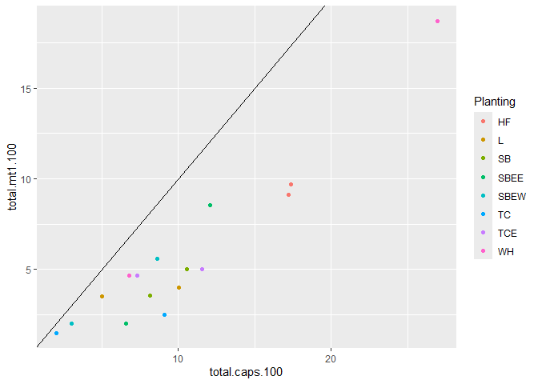<!-- -->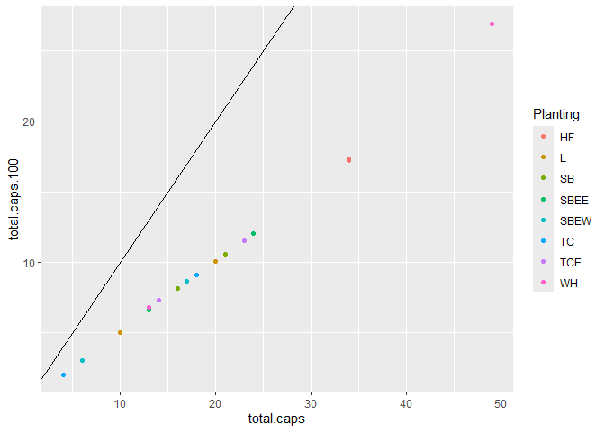<!-- -->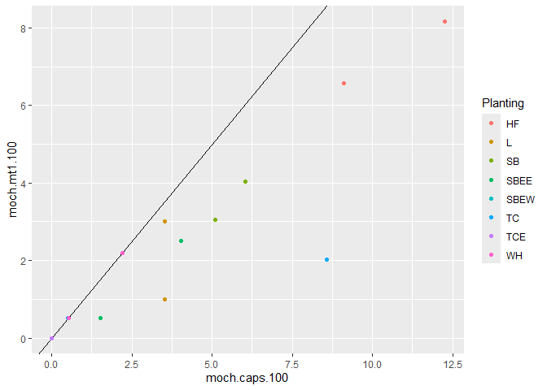<!-- -->

## Step 2: Integrate seed data to rodent community data

Now that we have the rodent community data ironed out, we need to join
this up with the seed removal data as well as management information
about the plantings, like burn history and bison presence.

I’ve thought quite a bit about the best way to tackle this part of the
analysis. After initially flirting with SEM analysis to trace the
effects of management –\> rodents –\> seed removal, I decided that
ultimately only having 8 plots was too constraining: we likely wouldn’t
have statistical power to detect important interactive effects (e.g.,
rodent diversity x seed provenance). So, I have for now ended up running
a regular ol’ glmer (with a binomial error structure) to look at direct
effects of rodent community metrics on seed removal. I feel like we know
enough about how this system works that we can add Discussion text
providing context for how management in turn shapes the rodents.

``` r
# Load in planting data, this is easy
grid.url <- "https://raw.githubusercontent.com/pguiden-pal/2024-REFUGE-seed-removal/refs/heads/main/data/REFUGE%20grid%20data.csv"
plantings <- read.csv(url(grid.url)) %>% 
  # Small cosmetic detail here, capitalizing bison and burns so that figs look nicer
  mutate(Burn.2024 = ifelse(Burn.2024 == 'burned', 'Burned', 'Unburned'),
         Bison = ifelse(Bison == 'bison', 'Bison', 'No bison'))

seed.url <- "https://raw.githubusercontent.com/pguiden-pal/2024-REFUGE-seed-removal/refs/heads/main/data/REFUGE%20seed%20removal%202.csv"
seed.data <- read.csv(url(seed.url))

invasives <- c('LOCO', 'LOMA', 'TRRE')

seeds <- seed.data %>% 
  # Keep only the depots with rodent access
  filter(is.na(Number.of.seeds.intact) == FALSE, Treatment == 'Rodents and Inverts') %>% 
  mutate(total.seeds = ifelse(Number.of.seeds.intact > 8, Number.of.seeds.intact, 8),
         intact.seeds = Number.of.seeds.intact,
         removed.seeds = total.seeds-intact.seeds,
         prop.removed.seeds = removed.seeds/total.seeds,
         bucket = paste(Planting, ' ',  Treatment, ' ', Month)) %>% 
  # Add management data
  left_join(plantings, by = "Planting") %>% 
  mutate(rest.age = 2024-Year.restored,
         invasive = ifelse(Species %in% invasives, 'Invasive', 'Native')) %>% 
  # Add rodent data, using right_join() to focus on the 8 plantings where we trapped
  right_join(rodents, by = c('Planting', 'Month'))
  
dim(seeds)
```

    ## [1] 112  46

``` r
summary(seeds)
```

    ##        ID          Planting            Month            Treatment        
    ##  Min.   :  1.0   Length:112         Length:112         Length:112        
    ##  1st Qu.:180.0   Class :character   Class :character   Class :character  
    ##  Median :262.0   Mode  :character   Mode  :character   Mode  :character  
    ##  Mean   :295.3                                                           
    ##  3rd Qu.:442.0                                                           
    ##  Max.   :524.0                                                           
    ##                                                                          
    ##    Species          Number.of.seeds.intact Number.of.damaged.seeds
    ##  Length:112         Min.   :0.000          Min.   :1.000          
    ##  Class :character   1st Qu.:4.750          1st Qu.:1.000          
    ##  Mode  :character   Median :6.000          Median :1.000          
    ##                     Mean   :5.696          Mean   :2.065          
    ##                     3rd Qu.:8.000          3rd Qu.:3.000          
    ##                     Max.   :9.000          Max.   :6.000          
    ##                                            NA's   :81             
    ##  Evidence.of.damaged.seeds.    Notes            total.seeds     intact.seeds  
    ##  Length:112                 Length:112         Min.   :8.000   Min.   :0.000  
    ##  Class :character           Class :character   1st Qu.:8.000   1st Qu.:4.750  
    ##  Mode  :character           Mode  :character   Median :8.000   Median :6.000  
    ##                                                Mean   :8.027   Mean   :5.696  
    ##                                                3rd Qu.:8.000   3rd Qu.:8.000  
    ##                                                Max.   :9.000   Max.   :9.000  
    ##                                                                               
    ##  removed.seeds  prop.removed.seeds    bucket             Bison          
    ##  Min.   :0.00   Min.   :0.0000     Length:112         Length:112        
    ##  1st Qu.:0.00   1st Qu.:0.0000     Class :character   Class :character  
    ##  Median :2.00   Median :0.2500     Mode  :character   Mode  :character  
    ##  Mean   :2.33   Mean   :0.2913                                          
    ##  3rd Qu.:3.25   3rd Qu.:0.4062                                          
    ##  Max.   :8.00   Max.   :1.0000                                          
    ##                                                                         
    ##   Burn.2024         Year.restored       lat             lon        
    ##  Length:112         Min.   :1992   Min.   :41.87   Min.   :-89.36  
    ##  Class :character   1st Qu.:2002   1st Qu.:41.88   1st Qu.:-89.35  
    ##  Mode  :character   Median :2009   Median :41.89   Median :-89.33  
    ##                     Mean   :2006   Mean   :41.89   Mean   :-89.33  
    ##                     3rd Qu.:2010   3rd Qu.:41.89   3rd Qu.:-89.31  
    ##                     Max.   :2013   Max.   :41.90   Max.   :-89.31  
    ##                                                                    
    ##     rest.age      invasive          total.effort     total.caps   
    ##  Min.   :11.0   Length:112         Min.   :182.0   Min.   : 4.00  
    ##  1st Qu.:14.5   Class :character   1st Qu.:196.4   1st Qu.:13.00  
    ##  Median :15.0   Mode  :character   Median :197.8   Median :17.50  
    ##  Mean   :18.0                      Mean   :196.2   Mean   :19.75  
    ##  3rd Qu.:21.5                      3rd Qu.:198.6   3rd Qu.:23.25  
    ##  Max.   :32.0                      Max.   :199.5   Max.   :49.00  
    ##                                                                   
    ##  total.caps.100     total.mt1     total.mt1.100      pman.caps     
    ##  Min.   : 2.020   Min.   : 3.00   Min.   : 1.515   Min.   : 0.000  
    ##  1st Qu.: 6.724   1st Qu.: 6.50   1st Qu.: 3.270   1st Qu.: 1.000  
    ##  Median : 8.860   Median : 9.00   Median : 4.688   Median : 3.500  
    ##  Mean   :10.142   Mean   :10.94   Mean   : 5.639   Mean   : 4.938  
    ##  3rd Qu.:11.662   3rd Qu.:12.50   3rd Qu.: 6.323   3rd Qu.: 8.000  
    ##  Max.   :26.923   Max.   :34.00   Max.   :18.681   Max.   :17.000  
    ##                                                                    
    ##  pman.caps.100       pman.mt1      pman.mt1.100      pleu.caps     
    ##  Min.   :0.0000   Min.   : 0.00   Min.   :0.0000   Min.   : 0.000  
    ##  1st Qu.:0.5169   1st Qu.: 1.00   1st Qu.:0.5047   1st Qu.: 0.000  
    ##  Median :1.7632   Median : 1.00   Median :0.5351   Median : 0.500  
    ##  Mean   :2.5019   Mean   : 2.25   Mean   :1.1425   Mean   : 5.688  
    ##  3rd Qu.:4.0125   3rd Qu.: 3.00   3rd Qu.:1.5104   3rd Qu.: 7.750  
    ##  Max.   :8.6294   Max.   :11.00   Max.   :5.5838   Max.   :44.000  
    ##                                                                    
    ##  pleu.caps.100        pleu.mt1       pleu.mt1.100       moch.caps    
    ##  Min.   : 0.0000   Min.   : 0.000   Min.   : 0.0000   Min.   : 0.00  
    ##  1st Qu.: 0.0000   1st Qu.: 0.000   1st Qu.: 0.0000   1st Qu.: 0.75  
    ##  Median : 0.2525   Median : 0.500   Median : 0.2519   Median : 5.50  
    ##  Mean   : 3.0058   Mean   : 4.062   Mean   : 2.1433   Mean   : 7.00  
    ##  3rd Qu.: 4.0365   3rd Qu.: 7.250   3rd Qu.: 3.7369   3rd Qu.:10.50  
    ##  Max.   :24.1758   Max.   :29.000   Max.   :15.9341   Max.   :24.00  
    ##                                                                      
    ##  moch.caps.100        moch.mt1       moch.mt1.100     pman.rel.ab    
    ##  Min.   : 0.0000   Min.   : 0.000   Min.   :0.0000   Min.   :0.0000  
    ##  1st Qu.: 0.3788   1st Qu.: 0.750   1st Qu.:0.3788   1st Qu.:0.1000  
    ##  Median : 2.8577   Median : 3.000   Median :1.5126   Median :0.1672  
    ##  Mean   : 3.5548   Mean   : 4.188   Mean   :2.1320   Mean   :0.2581  
    ##  3rd Qu.: 5.3281   3rd Qu.: 6.000   3rd Qu.:3.0247   3rd Qu.:0.2917  
    ##  Max.   :12.2449   Max.   :16.000   Max.   :8.1633   Max.   :1.0000  
    ##                                                                      
    ##   pleu.rel.ab      moch.rel.ab       pman.rel.act   pleu.rel.act   
    ##  Min.   :0.0000   Min.   :0.00000   Min.   :0.00   Min.   :0.0000  
    ##  1st Qu.:0.0000   1st Qu.:0.08333   1st Qu.:1.00   1st Qu.:0.0000  
    ##  Median :0.1250   Median :0.27206   Median :1.35   Median :0.5000  
    ##  Mean   :0.2926   Mean   :0.38968   Mean   :2.37   Mean   :0.6712  
    ##  3rd Qu.:0.5915   3rd Qu.:0.80000   3rd Qu.:3.50   3rd Qu.:1.2292  
    ##  Max.   :0.8889   Max.   :0.85714   Max.   :8.00   Max.   :2.0000  
    ##                                                                    
    ##   moch.rel.act       total           inv.simp    
    ##  Min.   :0.000   Min.   :0.7500   Min.   :1.000  
    ##  1st Qu.:0.750   1st Qu.:0.8972   1st Qu.:1.333  
    ##  Median :1.276   Median :1.0000   Median :1.515  
    ##  Mean   :1.410   Mean   :0.9404   Mean   :1.867  
    ##  3rd Qu.:1.617   3rd Qu.:1.0000   3rd Qu.:1.983  
    ##  Max.   :4.250   Max.   :1.0000   Max.   :4.571  
    ## 

I included the full code here for transparency, since there’s a healthy
amount of data organization happening here that we want to feel good
about before proceeding. All that being said, it works and you can see
there’s a sharp reduction in the size of the dataframe (went down from
500-some rows in the original seed dataframe to 112 rows here).

## Step 3: Construct and check constituent models

One last quick check before diving into models–I noticed some early
evidence of outliers in the rodent data, so I went ahead and screened
the rodent predictor variables for normality. All of them benefit from
log-transformation, which isn’t super surprising, so we’ll go with
log-transformed variables in the model to improve model fit.

    ## 
    ##  Shapiro-Wilk normality test
    ## 
    ## data:  log(1 + rodents$pman.caps.100)
    ## W = 0.94186, p-value = 0.3724

    ## 
    ##  Shapiro-Wilk normality test
    ## 
    ## data:  rodents$pman.caps.100
    ## W = 0.88126, p-value = 0.0406

    ## `stat_bin()` using `bins = 30`. Pick better value with `binwidth`.

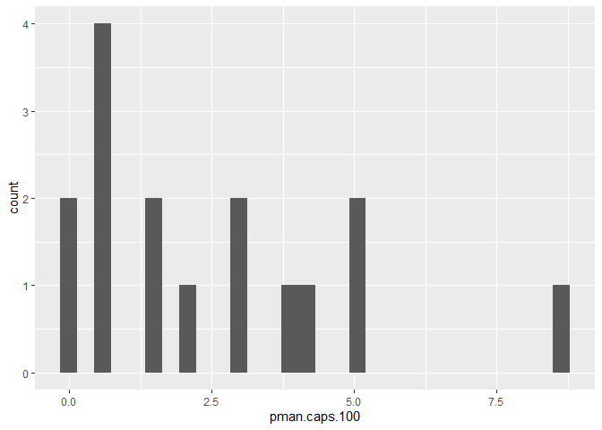<!-- -->

    ## 
    ##  Shapiro-Wilk normality test
    ## 
    ## data:  log(1 + rodents$pleu.caps.100)
    ## W = 0.78025, p-value = 0.001506

    ## 
    ##  Shapiro-Wilk normality test
    ## 
    ## data:  rodents$pleu.caps.100
    ## W = 0.55288, p-value = 6.008e-06

    ## `stat_bin()` using `bins = 30`. Pick better value with `binwidth`.

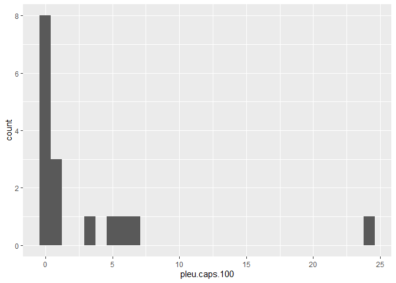<!-- -->

    ## 
    ##  Shapiro-Wilk normality test
    ## 
    ## data:  log(1 + rodents$moch.caps.100)
    ## W = 0.90555, p-value = 0.09865

    ## 
    ##  Shapiro-Wilk normality test
    ## 
    ## data:  rodents$moch.caps.100
    ## W = 0.86889, p-value = 0.02616

    ## `stat_bin()` using `bins = 30`. Pick better value with `binwidth`.

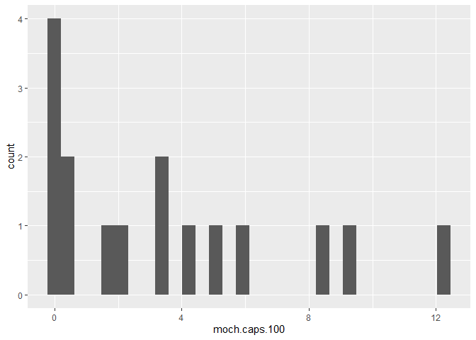<!-- -->

    ## 
    ##  Shapiro-Wilk normality test
    ## 
    ## data:  log(rodents$inv.simp)
    ## W = 0.88171, p-value = 0.04127

    ## 
    ##  Shapiro-Wilk normality test
    ## 
    ## data:  rodents$inv.simp
    ## W = 0.75453, p-value = 0.0007206

    ## `stat_bin()` using `bins = 30`. Pick better value with `binwidth`.

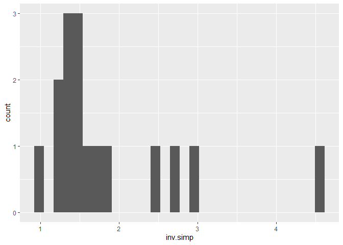<!-- -->

    ## # Check for Multicollinearity
    ## 
    ## Low Correlation
    ## 
    ##                               Term  VIF   VIF 95% CI Increased SE Tolerance
    ##                              Month 1.98 [1.60, 2.60]         1.41      0.51
    ##                      log(inv.simp) 2.12 [1.70, 2.80]         1.46      0.47
    ##                           invasive 4.17 [3.17, 5.62]         2.04      0.24
    ##           log(0.5 + pman.caps.100) 2.98 [2.32, 3.98]         1.73      0.34
    ##           log(0.5 + moch.caps.100) 2.45 [1.94, 3.25]         1.57      0.41
    ##           log(0.5 + pleu.caps.100) 2.79 [2.18, 3.72]         1.67      0.36
    ##             log(inv.simp):invasive 3.53 [2.71, 4.73]         1.88      0.28
    ##  invasive:log(0.5 + pman.caps.100) 2.79 [2.18, 3.71]         1.67      0.36
    ##  invasive:log(0.5 + moch.caps.100) 2.97 [2.31, 3.96]         1.72      0.34
    ##  invasive:log(0.5 + pleu.caps.100) 2.81 [2.19, 3.75]         1.68      0.36
    ##  Tolerance 95% CI
    ##      [0.38, 0.63]
    ##      [0.36, 0.59]
    ##      [0.18, 0.32]
    ##      [0.25, 0.43]
    ##      [0.31, 0.52]
    ##      [0.27, 0.46]
    ##      [0.21, 0.37]
    ##      [0.27, 0.46]
    ##      [0.25, 0.43]
    ##      [0.27, 0.46]

    ## Warning in printHypothesis(L, rhs, names(b)): one or more coefficients in the hypothesis include
    ##      arithmetic operators in their names;
    ##   the printed representation of the hypothesis will be omitted

    ## Warning in printHypothesis(L, rhs, names(b)): one or more coefficients in the hypothesis include
    ##      arithmetic operators in their names;
    ##   the printed representation of the hypothesis will be omitted

    ## Warning in printHypothesis(L, rhs, names(b)): one or more coefficients in the hypothesis include
    ##      arithmetic operators in their names;
    ##   the printed representation of the hypothesis will be omitted

    ## Warning in printHypothesis(L, rhs, names(b)): one or more coefficients in the hypothesis include
    ##      arithmetic operators in their names;
    ##   the printed representation of the hypothesis will be omitted

    ## Warning in printHypothesis(L, rhs, names(b)): one or more coefficients in the hypothesis include
    ##      arithmetic operators in their names;
    ##   the printed representation of the hypothesis will be omitted

    ## Warning in printHypothesis(L, rhs, names(b)): one or more coefficients in the hypothesis include
    ##      arithmetic operators in their names;
    ##   the printed representation of the hypothesis will be omitted

    ## Warning in printHypothesis(L, rhs, names(b)): one or more coefficients in the hypothesis include
    ##      arithmetic operators in their names;
    ##   the printed representation of the hypothesis will be omitted

    ## Analysis of Deviance Table (Type II Wald chisquare tests)
    ## 
    ## Response: cbind(removed.seeds, intact.seeds)
    ##                                    Chisq Df Pr(>Chisq)   
    ## Month                             2.3414  1   0.125976   
    ## log(inv.simp)                     7.7938  1   0.005243 **
    ## invasive                          0.0556  1   0.813529   
    ## log(0.5 + pman.caps.100)          0.0006  1   0.980400   
    ## log(0.5 + moch.caps.100)          5.7175  1   0.016797 * 
    ## log(0.5 + pleu.caps.100)          6.4379  1   0.011171 * 
    ## log(inv.simp):invasive            0.0627  1   0.802233   
    ## invasive:log(0.5 + pman.caps.100) 8.1938  1   0.004203 **
    ## invasive:log(0.5 + moch.caps.100) 1.6640  1   0.197068   
    ## invasive:log(0.5 + pleu.caps.100) 2.2295  1   0.135394   
    ## ---
    ## Signif. codes:  0 '***' 0.001 '**' 0.01 '*' 0.05 '.' 0.1 ' ' 1

For plotting purposes, we will also want an average of invasive/native
seed removal at each planting/month combo:

``` r
seed.means <- seeds %>% 
  group_by(Planting, invasive, Month) %>% 
  summarise(prob = mean(removed.seeds/total.seeds),
            pman.caps.100 = mean(pman.caps.100),
            pleu.caps.100 = mean(pleu.caps.100),
            moch.caps.100 = mean(moch.caps.100),
            inv.simp = mean(inv.simp))
```

    ## `summarise()` has grouped output by 'Planting', 'invasive'. You can override
    ## using the `.groups` argument.

### Pattern 1: When Peromyscus maniculatus activity is high, invasive seeds are more likely to be eaten

Ok, first key pattern we see is a significant interaction between P.man
activity and seed provenance. Specifically, at plots with low
*P.maniculatus* activity, native and invasive seeds are consumed
somewhat equally. However, where P.man are highly active, the model
predicts that invasive seeds are more than 6x more likely to be removed
than native seeds. The effect size is large, although the data are
noisy.

On that note, there’s one caveat here: the model seems to be
underestimating the plots with the highest seed removal (running a
zero-inflated glmmTMB model didn’t change this). I think one issue might
be that the native seed removal pattern is almost quadratic looking, and
the linear model can’t capture that pattern. I can’t think of an
ecological reason to include a quadratic term here, so I’m chalking it
up to high-variance data.

    ##  invasive pman.caps.100   prob     SE  df asymp.LCL asymp.UCL
    ##  Invasive           0.0 0.0690 0.0392 Inf    0.0219     0.197
    ##  Native             0.0 0.1545 0.0736 Inf    0.0572     0.355
    ##  Invasive           4.3 0.2168 0.0947 Inf    0.0849     0.452
    ##  Native             4.3 0.0630 0.0310 Inf    0.0235     0.158
    ##  Invasive           8.6 0.2866 0.1482 Inf    0.0885     0.625
    ##  Native             8.6 0.0482 0.0311 Inf    0.0132     0.161
    ## 
    ## Results are averaged over the levels of: Month 
    ## Confidence level used: 0.95 
    ## Intervals are back-transformed from the logit scale

    ## Warning: A numeric `legend.position` argument in `theme()` was deprecated in ggplot2
    ## 3.5.0.
    ## ℹ Please use the `legend.position.inside` argument of `theme()` instead.
    ## This warning is displayed once every 8 hours.
    ## Call `lifecycle::last_lifecycle_warnings()` to see where this warning was
    ## generated.

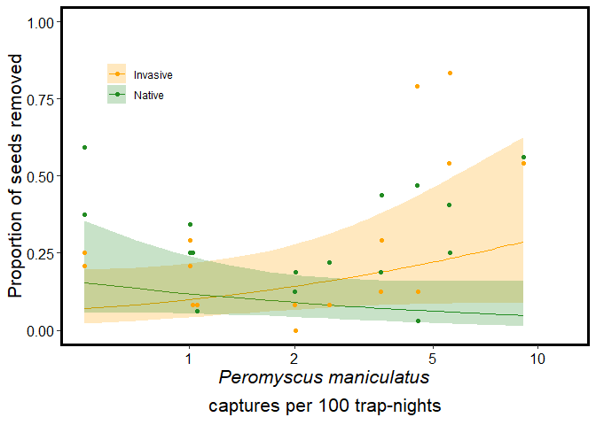<!-- -->

### Pattern 2: Peromyscus leucopus activity is associated with lower overall seed removal

Second pattern of note here is a strong main effect of *P. leucopus*
activity on seed removal: plots without *P.leucopus* had more than 3x
greater seed removal than the plot with the highest *P.leucopus*
activity. Note that there is no significant interactive effect here:
it’s the same for both native and invasive seeds.

Statistics note: this plot really highlights why log-transforming the
variables matters, given the super high leverage of the right-most
point. Interesting that one of the intermediate-*P. leucopus* activity
plots doesn’t conform to the pattern, otherwise it would be pretty
clean.

    ##  invasive pleu.caps.100   prob     SE  df asymp.LCL asymp.UCL
    ##  Invasive             0 0.2424 0.0650 Inf   0.13788     0.390
    ##  Native               0 0.2305 0.0567 Inf   0.13807     0.359
    ##  Invasive            12 0.1381 0.0866 Inf   0.03711     0.400
    ##  Native              12 0.0345 0.0227 Inf   0.00931     0.120
    ##  Invasive            24 0.1218 0.0940 Inf   0.02419     0.437
    ##  Native              24 0.0224 0.0180 Inf   0.00457     0.103
    ## 
    ## Results are averaged over the levels of: Month 
    ## Confidence level used: 0.95 
    ## Intervals are back-transformed from the logit scale

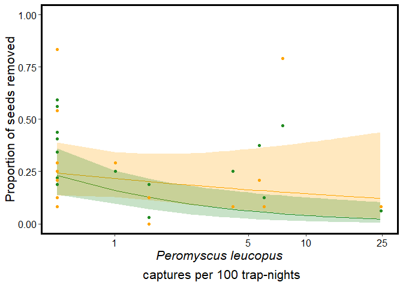<!-- -->

### Pattern 3: M.och activity is associated with lower overall seed removal

This pattern is super similar to the previous one, so I won’t harp on
it: another case of 3x greater seed removal where *M. ochrogaster* is
absent compared to where they are abundant.

    ##  invasive moch.caps.100   prob     SE  df asymp.LCL asymp.UCL
    ##  Invasive             0 0.2581 0.0917 Inf    0.1197     0.471
    ##  Native               0 0.2349 0.0751 Inf    0.1192     0.411
    ##  Invasive             6 0.1583 0.0725 Inf    0.0608     0.353
    ##  Native               6 0.0580 0.0281 Inf    0.0220     0.145
    ##  Invasive            12 0.1385 0.0802 Inf    0.0413     0.375
    ##  Native              12 0.0393 0.0239 Inf    0.0117     0.124
    ## 
    ## Results are averaged over the levels of: Month 
    ## Confidence level used: 0.95 
    ## Intervals are back-transformed from the logit scale

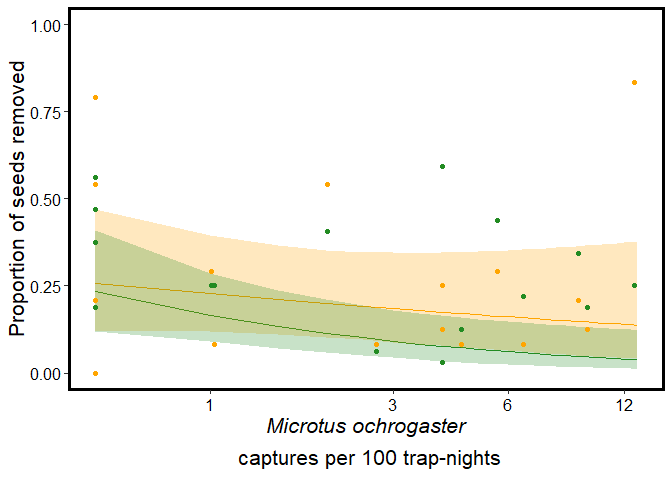<!-- -->

### Pattern 4: Diversity decreases seed removal, regardless of seed provenance

Kind of a cool way to put it all together…The lowest diversity plots
(with a single “effective species”) have 8x more seed removal compared
to the most diverse plots (with 4.5 effective species). Again, there is
no evidence that invasive and native seeds suffer different fates here,
each seems to respond equally from higher rodent biodiversity.

    ##  invasive inv.simp   prob     SE  df asymp.LCL asymp.UCL
    ##  Invasive     1.00 0.3238 0.1394 Inf   0.12088    0.6251
    ##  Native       1.00 0.1768 0.0850 Inf   0.06402    0.4028
    ##  Invasive     2.25 0.1415 0.0588 Inf   0.05999    0.2985
    ##  Native       2.25 0.0586 0.0256 Inf   0.02448    0.1338
    ##  Invasive     4.50 0.0621 0.0443 Inf   0.01472    0.2269
    ##  Native       4.50 0.0211 0.0152 Inf   0.00509    0.0836
    ## 
    ## Results are averaged over the levels of: Month 
    ## Confidence level used: 0.95 
    ## Intervals are back-transformed from the logit scale

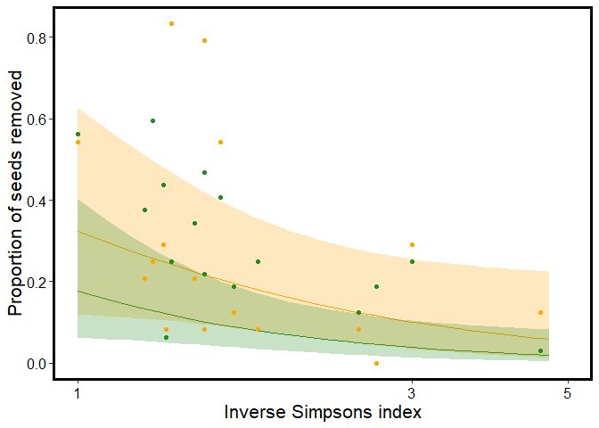<!-- -->

## Final figure output

Ok, now to glue these key findings into a single 4-panel figure using
the “patchwork” package. Outputting this in a nice large dimension,
although I will touch up with powerpoint/illustrator to add letters,
extra space between the columns, and center/relabel color legends.

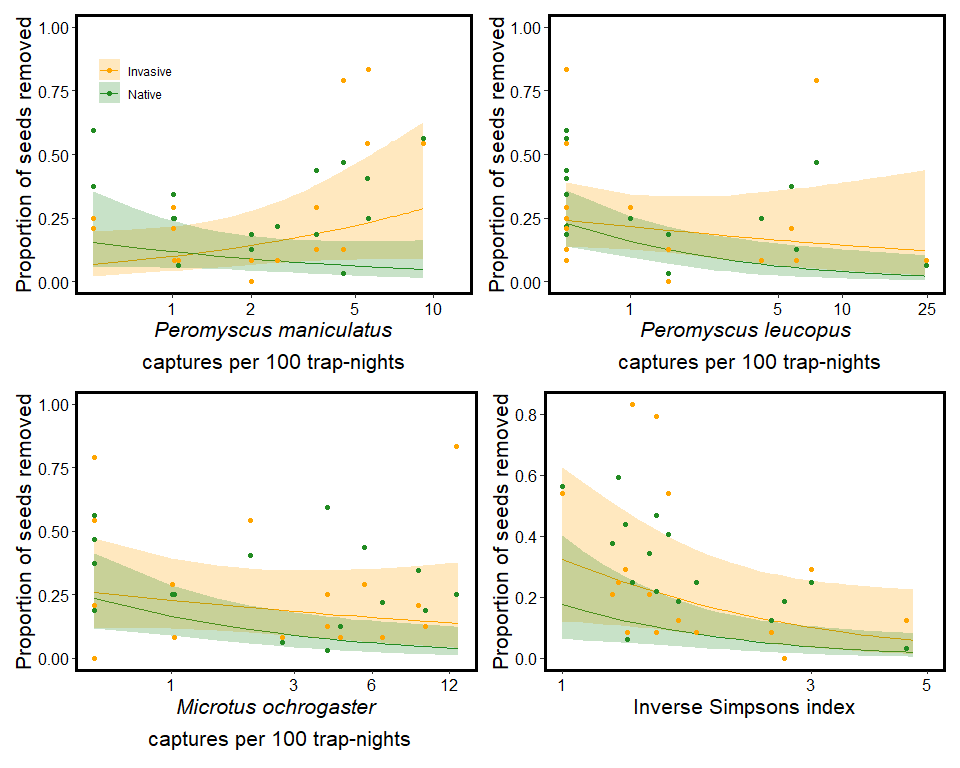<!-- -->
